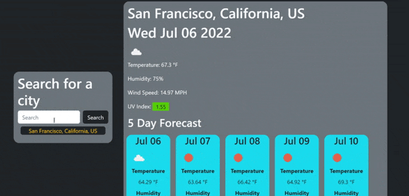

# Search-by-City Weather Dashboard

## Description 
This simple site allows you to view the current weather in any given city, plus a 5-day forecast. 

It makes use of the Open Weather API (see [Credits](#credits)).

The site can be found deployed [here](https://corasinth.github.io/weather-by-city/).

## Table of Contents

* [Installation](#installation)
* [Credits](#credits)
* [License](#license)
* [Features](#features)
* [Tests](#tests)

## Usage 

The site is set to automatically load a predetermined city. From this home search one can simply search for a city in the search box, or search for a city, state/province, country code if the city you're looking for doesn't appear. 

Previously searched citys and the current city are displayed with their state/province (if any) as well as their country code. 

The search history is limited to 10 items to prevent clogging the screen, and is dynamically updated with each unique search.

Below is a demonstration of the site.

## Credits

[Open Weather Map's](https://openweathermap.org/) One Call (1.0) API and geocoding API provide the backbone of the site's weather functionality. 

[Font Awesome](https://fontawesome.com/icons/sun?s=solid) provided the site's icon.

## [License](./LICENSE)

This website uses the open-source MIT License.

## Features

The websites UV index display is color coded programmatically. At 0, the index color is green. As it approaches 5, the color shifts to yellow. From 5 upwards, the color shifts to red. The color changes at a linear pace. 

A very small number of cities have a UI index of above 10. For these, according to the standardized color scheme, the color rapidly shifts to purple from 10-11.5, and stays there for any higher numbers. Any value higher than 10 should be considered "extreme", and official guidance is to stay indoors as even brief exposure can cause burns.

---
